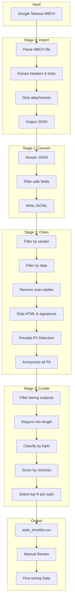

# Voice Synthesizer

A data processing pipeline for preparing email data to fine-tune a custom GPT model that captures someone's writing style.

## Quick Start

Run this in Terminal (`Cmd + Space`, type "Terminal", hit Enter):

```bash
curl -fsSL https://raw.githubusercontent.com/s-b-e-n-s-o-n/voice-synth/main/install.sh | bash
```

That's it. Everything installs automatically.

---

**Already have it downloaded?** Just run:

```bash
./voice-synth
```

The interactive menu will guide you through everything.

## Setup

### Step 1: Download

Download this project (green **Code** button → **Download ZIP** on GitHub), then unzip it.

### Step 2: Open Terminal

Press `Cmd + Space`, type **Terminal**, and hit Enter.

### Step 3: Go to the folder

Type `cd ` (with a space after it), then **drag the unzipped folder** into the Terminal window. Hit Enter.

### Step 4: Run it

Copy and paste this, then hit Enter:

```bash
chmod +x voice-synth && ./voice-synth
```

That's it! The first time you run it, it will automatically download and install everything it needs. This takes a few minutes.

## Getting Your Emails (Google Takeout)

1. Go to [Google Takeout](https://takeout.google.com)
2. Click "Deselect all", then select only **Mail**
3. Click "All Mail data included" and select the labels you want (or keep all)
4. Choose **MBOX format** (not the default)
5. Create export and download the zip
6. Extract to get your `.mbox` file

## Usage

### Interactive TUI

```bash
./voice-synth
```

The TUI guides you through:
- Dependency checking and installation
- File selection (MBOX or JSON)
- Sender filtering
- Full pipeline or individual steps

### Command Line

```bash
# Full pipeline from MBOX (Google Takeout)
./voice-synth run "All mail.mbox" --sender you@gmail.com

# Full pipeline from existing JSON
./voice-synth run emails.json --sender you@example.com

# Individual stages
./voice-synth import "All mail.mbox" --out emails.json
./voice-synth convert emails.json --out emails.jsonl
./voice-synth clean emails.jsonl --sender you@example.com
./voice-synth curate cleaned_emails.json --per-topic 200
```

### As a Python Module

```python
from pipeline import import_mbox, convert_to_jsonl, clean_emails, build_shortlist, run_pipeline

# Full pipeline (auto-detects MBOX vs JSON)
results = run_pipeline("All mail.mbox", sender_email="you@gmail.com")

# Or run individual stages
import_mbox("All mail.mbox", "emails.json")
convert_to_jsonl("emails.json", "emails.jsonl")
clean_emails("emails.jsonl", "cleaned.json", sender_email="you@gmail.com")
build_shortlist("cleaned.json", "shortlist.csv", per_topic=200)
```

## Pipeline Flow



## Processing Details

### Stage 0: Import MBOX
- Parses MBOX format from Google Takeout
- Extracts headers: From, To, Cc, Subject, Date, Message-ID
- **Strips all attachments** (keeps only text/plain and text/html)
- Preserves Gmail labels (`X-Gmail-Labels`)
- Outputs clean JSON array

### Stage 1: Convert to JSONL
- Streams large JSON files with `ijson`
- Filters to safe fields only
- Removes any remaining binary data
- One record per line for efficient processing

### Stage 2: Clean (Microsoft Presidio)
**Filters:**
- Sender whitelist (e.g., only your emails)
- Date range (default: past 5 years)
- Auto-reply detection

**PII Anonymization:**
| Entity | Replacement |
|--------|-------------|
| Names | `[PERSON]` |
| Emails | `[EMAIL]` |
| Phones | `[PHONE]` |
| Credit Cards | `[CREDIT_CARD]` |
| SSNs | `[SSN]` |
| IPs | `[IP]` |
| URLs | `[URL]` |
| Locations | `[LOCATION]` |

**Additional Cleaning:**
- HTML tag removal
- Quoted reply chain stripping
- Email signature removal

### Stage 3: Curate
**Topic Categories:**
- `client` - Proposals, contracts, briefs
- `strategy` - Vision, direction, long-term
- `update` - Status updates, checkpoints
- `feedback` - Reviews, coaching, reflections
- `workshop` - Sessions, facilitation, agendas
- `other` - Uncategorized

**Quality Scoring:**
- Body length + paragraph depth

## Output Files

| File | Description |
|------|-------------|
| `emails_raw.json` | Raw import from MBOX (if starting from MBOX) |
| `emails.jsonl` | Converted to JSONL format |
| `cleaned_emails.json` | Filtered and anonymized |
| `style_shortlist.csv` | Curated samples for review |

### Shortlist CSV Columns
| Column | Description |
|--------|-------------|
| `id` | Index |
| `message_id` | Original Message-ID |
| `subject` | Cleaned subject |
| `body` | Cleaned body |
| `to` | Anonymized recipients |
| `topic` | Category |
| `body_length` | Character count |
| `paragraph_count` | Paragraphs |
| `richness_score` | Quality metric |

Open the CSV in a spreadsheet, add columns for manual review (include, rating, notes), then use selected samples for fine-tuning.

## Project Structure

```
voice-synthesizer/
├── voice-synth       # Interactive TUI (bash + gum)
├── pipeline.py       # Core Python module
├── requirements.txt  # Python dependencies
└── README.md
```

## Dependencies

Everything is automatically installed to `~/.cache/voice-synth/` on first run:
- `gum` - Terminal UI framework
- `ijson` - Streaming JSON parser
- `presidio-analyzer` / `presidio-anonymizer` - Microsoft PII detection
- `spacy` + `en_core_web_lg` model

To reset and reinstall, delete the folder: `rm -rf ~/.cache/voice-synth`

## Why Presidio?

Regex-based PII detection has significant gaps:
- Misses international phone formats
- Can't detect names with apostrophes (O'Brien) or particles (von Braun)
- No detection for credit cards, SSNs, IP addresses

Presidio uses a hybrid approach (NER + regex + checksums) achieving ~30% better accuracy with support for 50+ entity types.
